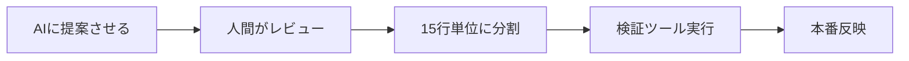

# 🤖 AI Conduit 無料プレゼント
## 【Webデザイン完全攻略】AI時代のUI/UXデザインとCSSコード生成チートシート

---

### 📌 なぜこのチートシートが必要か？
GCCのAI生成コード拒否方針からわかる通り、**「AI生成物をそのまま使う時代は終わった」**。しかしWebデザイン・UIデザインの現場では、AIを**「提案ツール」**として活用するのが現在の最適解です。本プレゼントでは、AIを活用しつつも「人間が責任を持って調整する」ための実践的テクニックを厳選しました。

---

## 1️⃣ Figmaプロンプト実践3選（コピペOK）

### ① デザインシステム生成プロンプト
```
あなたはシニアUIデザイナーです。以下の条件でデザイントークンを生成してください。
- カラーパレット：モダンなミニマリズム（背景は白、アクセントは青系）
- タイポグラフィ：Noto Sans JP + Interの組み合わせ
- スペーシング：4pxグリッドシステム
- 角丸：8px / 16px / 24pxの3段階
出力形式：FigmaのVariablesとしてインポート可能なJSON形式で出力
```

### ② レスポンシブ対応チェックプロンプト
```
このFigmaデザインのレスポンシブ対応をレビューしてください。
- ブレークポイント：375px / 768px / 1024px / 1440px
- 特にナビゲーション、カードグリッド、フォームの3点を重点的に
- 問題点は具体的に「どの要素が」「何pxで」「どう崩れるか」を明示
- 修正案はCSSのメディアクエリ例付きで提案
```

### ③ アクセシビリティ診断プロンプト
```
このUIデザインのアクセシビリティ（WCAG 2.1 AA準拠）を診断してください。
- コントラスト比：本文テキストは4.5:1以上、大きめテキストは3:1以上
- フォーカスリングの可視性
- タップターゲットサイズ（44×44px以上推奨）
- 診断結果は「問題箇所 → 改善コード」の形式で出力
```

---

## 2️⃣ 15行ルール対策！CSSコード分割テンプレート

GCCの15行ルールに倣い、**「15行以内で完結するCSSユーティリティ」**を5つ用意しました。商用利用OK、コピペで即動作します。

### ① モダングラスモーフィズム（14行）
```css
.glass {
  background: rgba(255, 255, 255, 0.1);
  backdrop-filter: blur(10px);
  -webkit-backdrop-filter: blur(10px);
  border: 1px solid rgba(255, 255, 255, 0.18);
  border-radius: 16px;
  box-shadow: 0 8px 32px rgba(0, 0, 0, 0.1);
  padding: 24px;
  transition: all 0.3s ease;
}
.glass:hover { background: rgba(255, 255, 255, 0.15); }
```

### ② スケルトンローディング（13行）
```css
.skeleton {
  background: linear-gradient(90deg, #f0f0f0 25%, #e0e0e0 50%, #f0f0f0 75%);
  background-size: 200% 100%;
  animation: shimmer 1.5s infinite;
  border-radius: 8px;
  min-height: 20px;
}
@keyframes shimmer {
  0% { background-position: 200% 0; }
  100% { background-position: -200% 0; }
}
```

### ③ フェードインアニメーション（12行）
```css
.fade-in {
  opacity: 0;
  transform: translateY(20px);
  transition: opacity 0.6s ease, transform 0.6s ease;
}
.fade-in.visible { opacity: 1; transform: translateY(0); }
/* IntersectionObserverで.visibleを追加 */
```

### ④ ダークモード自動切替（14行）
```css
:root { --bg: #ffffff; --text: #333333; }
@media (prefers-color-scheme: dark) {
  :root { --bg: #1a1a1a; --text: #f5f5f5; }
}
body {
  background: var(--bg);
  color: var(--text);
  transition: all 0.3s ease;
}
```

### ⑤ コンテナクエリ対応カード（15行）
```css
.card-container { container-type: inline-size; }
@container (max-width: 400px) {
  .card { flex-direction: column; padding: 16px; }
  .card-title { font-size: 1.2rem; }
}
@container (min-width: 401px) {
  .card { flex-direction: row; padding: 24px; }
}
```

---

## 3️⃣ AI時代のCSS設計「7つの掟」

GCCの「AI生成コード拒否」から学ぶ、**人間が責任を持つ**ための設計原則です。

| 原則 | 内容 | 具体的対策 |
|------|------|------------|
| 1. **分割** | 15行以上はコンポーネント化 | 1関数1役割、10〜15行で区切る |
| 2. **検証** | AI出力を盲信しない | `npx stylelint` + `npm run test` を必ず実行 |
| 3. **命名** | 意味のあるクラス名 | BEM（Block__Element--Modifier）を徹底 |
| 4. **管理** | 依存関係を最小化 | CSSは3ファイル以内に分割 |
| 5. **記録** | 生成元をコメントで明記 | `/* Generated by AI: 2024-01-15 */` |
| 6. **更新** | 定期的な見直し | 毎月1回リファクタリング |
| 7. **共有** | チームでルールを徹底 | ポリシーをREADME.mdに明文化 |

---

## 4️⃣ Figma→CSS変換おすすめツール3選

| ツール名 | 特徴 | 料金 | 変換精度 |
|----------|------|------|----------|
| **Anima** | Figmaプラグイン、React/Vue対応 | Free〜$39/月 | ★★★★★ |
| **Figma to Code** | HTML/CSS/React/Tailwind対応 | Free | ★★★★☆ |
| **DhiWise** | フルスタック生成、カスタムUI | Free〜$49/月 | ★★★★★ |

**おすすめワークフロー：**
```bash
# 1. Figmaでデザイン作成
# 2. AnimaでReact+CSS出力
# 3. 生成されたコードを15行単位で分割
# 4. stylelintで検証
npx stylelint "src/**/*.css" --fix
# 5. ビジュアルリグレッションテスト
npx percy exec -- npm test
```

---

## 5️⃣ 今日から使える「AI+人間」ハイブリッドワークフロー

GCCのポリシーに学ぶ、**「AI提案→人間調整」**の5ステップ：



**具体的なプロンプト例：**
```
「このセクションのCSSを10〜15行のユニットに分割して。
各ユニットにコメントで説明を付けて。レスポンシブ対応は
メディアクエリではなくコンテナクエリを使用して。」
```

---

## 6️⃣ 保存版！CSSプロパティ早見表（頻出30選）

| カテゴリ | プロパティ | 値の例 | 用途 |
|----------|-----------|--------|------|
| **レイアウト** | display | grid / flex / inline-block | 全体構造 |
| | grid-template-columns | repeat(12, 1fr) | グリッド設計 |
| | gap | 16px | 余白統一 |
| **デザイン** | backdrop-filter | blur(8px) | ガラス効果 |
| | clip-path | polygon(0% 0%, 100% 0%, 80% 100%) | 斜めカット |
| | mix-blend-mode | multiply / screen | 画像重ね |
| **アニメ** | transition | all 0.3s cubic-bezier(0.4, 0, 0.2, 1) | 滑らか動作 |
| | animation-play-state | paused / running | 一時停止 |
| **レスポンシブ** | container-type | inline-size | コンテナクエリ |
| **アクセシビリティ** | focus-visible | outline: 2px solid #4A90D9 | キーボード対応 |

---

## 🎯 まとめ：AIとどう付き合うか

GCCの15行ルールは、**「AIは提案者、人間は責任者」**という原則を明確にしました。Webデザインの現場でも同様に、AIを活用しつつ人間が最終判断を下すことが品質保証の鍵となります。

**本プレゼントの3つのポイント：**
1. **AIプロンプトは「具体的に」** — 数値・ツール名・出力形式を指定
2. **コードは「15行単位」で分割** — 保守性と検証容易性が向上
3. **検証ツールを「必ず実行」** — stylelintやテストで品質を担保

---

## このプレゼントはAI Conduitからお届けしています
毎日最新AIニュースを自動配信中！
- YouTube: https://www.youtube.com/@AI.Conduit
- Instagram: https://www.instagram.com/aiconduit/
- X: https://x.com/AIconduit777

コメントに「AI」と書いてくれた方にこのプレゼントをお届けしています🎁

**次回予告：** 「AI生成コードを人間が検証する5つのチェックポイント」をお届けします。お楽しみに！