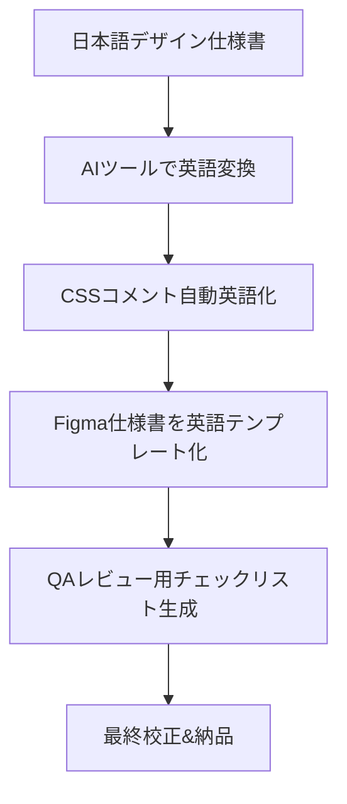

# 🤖 AI Conduit 無料プレゼント

## 英文マニュアルを自動校正！Webデザイナー向けAI英語化チートシート

動画で紹介した「英文マニュアル強制校正ツール」を最大限活用するための、Webデザイン・UIデザイン特化型**即戦力コンテンツ**をまとめました。

---

## 🎯 1. 英文マニュアル校正AIツール（GitHub急上昇）の使い方

```bash
# インストール（GitHubからクローン）
git clone https://github.com/your-ai-tool/manual-corrector.git
cd manual-corrector
npm install

# 実行コマンド（例）
npx manual-corrector --input ./docs/design_manual.md --output ./docs/design_manual_en.md
```

### 3ステップで英語校正完了
1. **入力**: 日本語 or 簡易英語のマニュアルを用意
2. **自動変換**: `--auto-translate` フラグで専門用語を平易な英語に
3. **出力**: 国際標準フォーマット（IEEE/Googleスタイル）で書き出し

---

## ✨ 2. UIデザイナー向け「英語UIテキスト」変換プロンプト集

ChatGPT / Claude / Gemini で使える即効プロンプト：

```
あなたはUI/UXライターです。以下の日本語UIテキストを、
「簡潔・明確・アクション指向」の英語に変換してください。
【ルール】
・文字数は日本語の1.2倍以内に収める
・動詞で始める（例: "Save", "Delete", "Confirm"）
・技術用語はそのまま残す
・ボタンは大文字開始、ツールチップは文全体

日本語テキスト: 「保存しますか？変更内容が失われます」
```

**出力例**: `Unsaved changes will be lost. Save now?`

---

## 🎨 3. CSSコメントの英語化チートシート

```css
/* Before: ヘッダー部分のスタイル */
/* After: Header section styles */
.header {
  display: flex;
  justify-content: space-between;
}

/* Before: モバイルでメニュー隠す */
/* After: Hide menu on mobile devices */
@media (max-width: 768px) {
  .nav-menu { display: none; }
}

/* Before: ホバーで色変える */
/* After: Change color on hover state */
.btn:hover { background-color: #0066cc; }
```

**おすすめ英語コメントパターン**:
- `// TODO: Refactor this component for reusability`
- `/* FIXME: Improve accessibility for screen readers */`
- `// NOTE: This uses CSS Grid fallback for older browsers`

---

## 🖼️ 4. Figmaプロンプト→英文デザイン仕様書変換テンプレート

```markdown
# Design Specification: [Project Name]

## 1. Design Tokens
- Primary Color: `#0F62FE` (IBM Carbon Blue)
- Font Family: `Inter, sans-serif`
- Spacing Scale: 4px base unit (4, 8, 12, 16, 24, 32, 48)

## 2. Component: Navigation Bar
- **Height**: 64px (desktop), 56px (mobile)
- **Background**: `#FFFFFF` with `box-shadow: 0 2px 4px rgba(0,0,0,0.1)`
- **State**: Active link = `font-weight: 600`, color `#0F62FE`

## 3. Interaction Rules
- Hover: `opacity: 0.8`, `transition: all 0.3s ease`
- Focus: `outline: 2px solid #0F62FE`, `outline-offset: 2px`
- Error: Show inline message within 200ms, use `#DA1E28`
```

---

## 🧰 5. 英語マニュアル校正ツール × Webデザイン連携コマンド集

```bash
# マークダウンで書いたデザイン仕様書を一括英語化
npx manual-corrector --input ./specs/ --format md --style google

# コードコメントだけを抽出して英語化
npx manual-corrector --extract-comments --lang css,js,html

# FigmaのデザイントークンをJSONで書き出し→英語コメント付与
npx figma-export --token YOUR_FIGMA_TOKEN --output ./design-tokens.json
```

---

## 📋 6. すぐ使える「英語UI用語」クイック変換表

| 日本語 | 英語（推奨） | 避ける表現 |
|--------|-------------|-----------|
| 保存する | **Save** | Store/Keep |
| 削除する | **Delete** | Remove/Erase |
| 設定 | **Settings** | Configuration |
| 検索 | **Search** | Find/Lookup |
| 送信 | **Submit** | Send |
| キャンセル | **Cancel** | Abort/Quit |
| 読み込み中 | **Loading…** | Fetching |
| エラーが発生 | **Something went wrong** | Error occurred |

---

## 🚀 7. 英語マニュアル自動生成の5ステップワークフロー



---

## 💎 まとめ：今日からできる英語化アクション

1. **今すぐ**: 上記のCSSコメント英語化を自分のプロジェクトに適用
2. **今週中**: Figma仕様書テンプレートを英語で作成
3. **今月中**: AIツールで過去の日本語マニュアルを英語化して納品実績を作る

**保存して、明日の業務から英語ドキュメント作成を始めましょう！**

---
## このプレゼントはAI Conduitからお届けしています

毎日最新AIニュースを自動配信中！

- 📺 YouTube: https://www.youtube.com/@AI.Conduit
- 📸 Instagram: https://www.instagram.com/aiconduit/
- 🐦 X: https://x.com/AIconduit777

コメントに「**AI**」と書いてくれた方にこのプレゼントをお届けしています🎁

**#AIConduit #英語マニュアル #UIデザイン #Webデザイン #Figma**