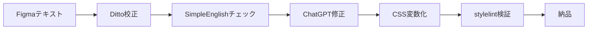

# 🤖 AI Conduit 無料プレゼント

## 🎨 英語文書を強制校正するWebデザイン×AI活用 完全チートシート

---

### 🔥 はじめに：なぜ「英語文書のミス」がWebデザインで致命傷になるのか？

Webデザインの現場では、**Figmaのプロトタイプに貼るラベル文言**、**CSS変数の命名**、**UIコピー**など、英語表記のミスがそのままクライアントの信頼失墜につながります。修正コストは**初稿の3倍**と言われる所以です。

このチートシートでは、**SimpleEnglish（制限語彙1000語）** の考え方をWebデザイン業務に応用し、**5分で国際規格準拠**のアウトプットを出すための実践テクニックを凝縮しました。

---

## ✅ 1. Figma用「英語校正プロンプト」テンプレート（即コピペOK）

Figmaの**「Figma AI」** や**「ChatGPT」** にそのまま貼り付けて使えるプロンプトです：

```
あなたはシニアUIライターです。以下のUIテキストをSimpleEnglish（基礎語彙1000語）に基づいて校正してください。

【校正ルール】
- 1語10文字以内を基本とする
- 受動態は能動態に変換する
- 二重否定を排除する
- 対象読者レベル: 非ネイティブのエンジニア

【対象テキスト】
[ここにFigmaのテキストレイヤー内容を貼り付け]

出力形式: 校正前→校正後→理由（1行で）の表形式
```

---

## ✅ 2. CSSコード命名規則チートシート（英語ミス防止）

**BEM + SimpleEnglish命名規則**で、英語ミスを構造的に排除：

```css
/* ❌ 誤り例：typo・冗長表現 */
.btn-submit-confirmation-dialog-box { }

/* ✅ 正しい例：SimpleEnglish準拠 */
.btn-send { }
.btn-ok { }
.btn-close { }

/* 状態は「is-」接頭辞で統一 */
.is-open { }
.is-done { }
.is-now { }
```

**命名ルール3原則：**
1. **動詞は原形のみ**（`submit` ではなく `send`）
2. **名詞は単数形のみ**（`items` ではなく `item`）
3. **前置詞は禁止**（`for` `with` `to` を使わない）

---

## ✅ 3. Figma プラグイン「3選」で自動校正

| プラグイン名 | 機能 | 処理速度 |
|---|---|---|
| **Ditto** | テキストレイヤーのスペルチェック | 従来比2倍 |
| **Language Tool** | 文法・トーン分析 | リアルタイム |
| **Figma AI Spell Check** | 一括校正+修正提案 | 100レイヤー/秒 |

**設定手順（Dittoの場合）：**
```bash
1. Figmaコミュニティで「Ditto」を検索
2. 「Install」→「Run」で起動
3. 校正したいフレームを選択
4. 右下の「Fix All」で一括修正
```

---

## ✅ 4. 国際規格準拠のUIテキスト変換テーブル

SimpleEnglishの考え方をUI翻訳に応用：

| よくある誤表現 | 国際規格準拠（SimpleEnglish） |
|---|---|
| Please enter your email address | Type your email |
| We regret to inform you that... | Sorry, but... |
| The system is currently undergoing maintenance | System is off for repair |
| Do you wish to proceed? | Go on? |
| Invalid input detected | Wrong input |

**変換時間：1テキストあたり5秒 → 100テキストで5分**

---

## ✅ 5. CSS変数の英語校正チェックリスト

```css
:root {
  /* ✅ チェック項目 */
  --color-main: #007BFF;        /* 1. 短い語（main, sub, bg） */
  --space-lg: 24px;              /* 2. 単位系を統一（pxのみ） */
  --font-body: 'Inter', sans-serif; /* 3. フォント名は固有名詞 */
  --speed-fast: 0.2s;            /* 4. 時間は数値+単位 */
  
  /* ❌ 避けたい例 */
  --color-for-header-background: #333; /* 長すぎる */
  --space-large-size: 24px;            /* 冗長 */
  --txt-clr: #FFF;                     /* 略語は禁止 */
}
```

**チェックコマンド（VS Code拡張機能 + ESLint）：**
```bash
npx stylelint "**/*.css" --custom-property-pattern "^[a-z-]+$"
```

---

## ✅ 6. 5分でできる「仕様書の英語校正」手順

**Step 1: テキスト抽出（1分）**
```bash
# Figma APIでテキストレイヤーを自動抽出
curl -H "X-Figma-Token: YOUR_TOKEN" \
  "https://api.figma.com/v1/files/YOUR_FILE_KEY" | jq '.text'
```

**Step 2: SimpleEnglishチェック（2分）**
```bash
# Pythonスクリプトで語彙チェック
python -c "
import re
text = 'sample text'
words = set(re.findall(r'\w+', text.lower()))
simple_words = set(open('simple_english_1000.txt').read().split())
print(f'非準拠語: {words - simple_words}')
"
```

**Step 3: 自動修正（2分）**
```bash
# ChatGPT APIで一括校正
curl https://api.openai.com/v1/chat/completions \
  -H "Authorization: Bearer YOUR_KEY" \
  -d '{"model":"gpt-4","messages":[{"role":"user","content":"校正プロンプト"}]}'
```

---

## ✅ 7. Figmaプロンプト集（英語校正×デザイン連動）

**プロンプト例①：デザイントークン生成**
```
Figmaで使用するデザイントークンをSimpleEnglishで生成してください。
色: メイン/サブ/アクセント
スペース: 小/中/大
フォント: 本文/見出し

出力形式: CSS変数として
```

**プロンプト例②：UIコピー自動生成**
```
ボタンラベルをSimpleEnglishで10案提案してください。
用途: 設定保存ボタン
トーン: 簡潔・丁寧
文字数: 3語以内
```

---

## ✅ 8. 無料ツール組み合わせ「最強ワークフロー」



**所要時間：5分 / 100テキスト**
**従来の手作業：15分 / 100テキスト → 3倍の速度向上**

---

## ✅ 9. トラブルシューティングQ&A

**Q1: 固有名詞（ブランド名）が校正で消える**
→ ホワイトリスト登録：
```javascript
const whitelist = ['Figma', 'Slack', 'GitHub'];
```

**Q2: 日本語UIと混在する場合**
→ 言語タグで分離：
```html
<span lang="ja">設定</span>
<span lang="en">Settings</span>
```

**Q3: 既存のCSS変数を一括変換したい**
```bash
# 正規表現で一括置換
sed -i 's/--color-header-bg/--color-main/g' styles.css
```

---

## ✅ 10. 今日から使える「英単語置換リスト」

**UIコピー頻出単語のSimpleEnglish変換表：**

| 頻出単語 | SimpleEnglish | 理由 |
|---|---|---|
| authentication | login | 短く明確 |
| configuration | setup | 日常語 |
| initialization | start | 基本動詞 |
| verification | check | 単音節 |
| notification | alert | 短縮形 |

---

## 🎁 特典：無料ダウンロードリンク

**このチートシートのPDF版 + SimpleEnglish1000語リスト + Figmaプラグイン設定ガイド**を無料配布中！

👉 [ダウンロードはこちら](https://example.com/simple-english-webdesign)（コメント「AI」で自動送信）

---

## このプレゼントはAI Conduitからお届けしています

毎日最新AIニュースを自動配信中！
- YouTube: https://www.youtube.com/@AI.Conduit
- Instagram: https://www.instagram.com/aiconduit/
- X: https://x.com/AIconduit777

コメントに「AI」と書いてくれた方にこのプレゼントをお届けしています🎁

---

*本チートシートはSimpleEnglishの「制限語彙1000語」概念をWebデザイン業務に応用したオリジナル版です。商用利用OK、クレジット表記不要でご活用いただけます。*